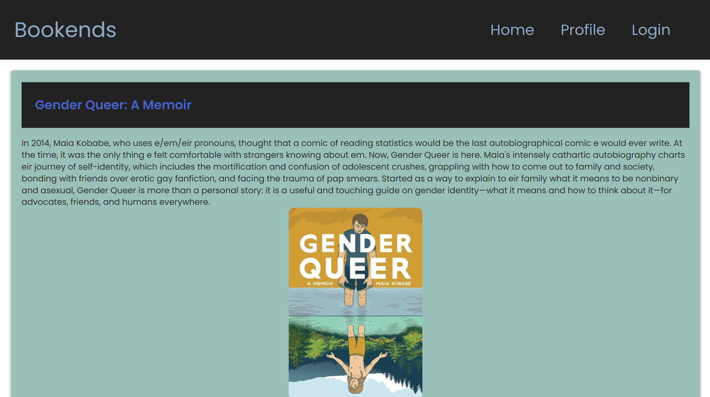
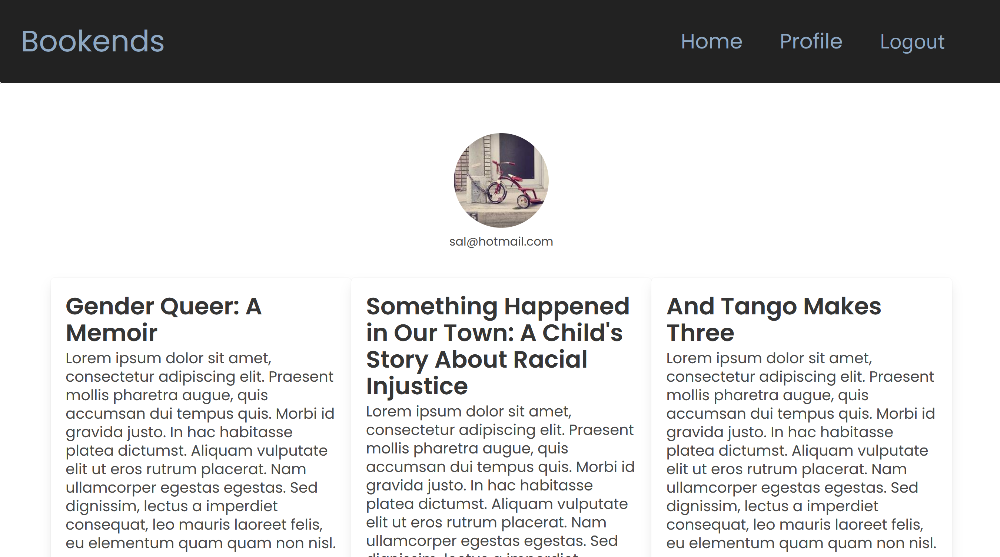
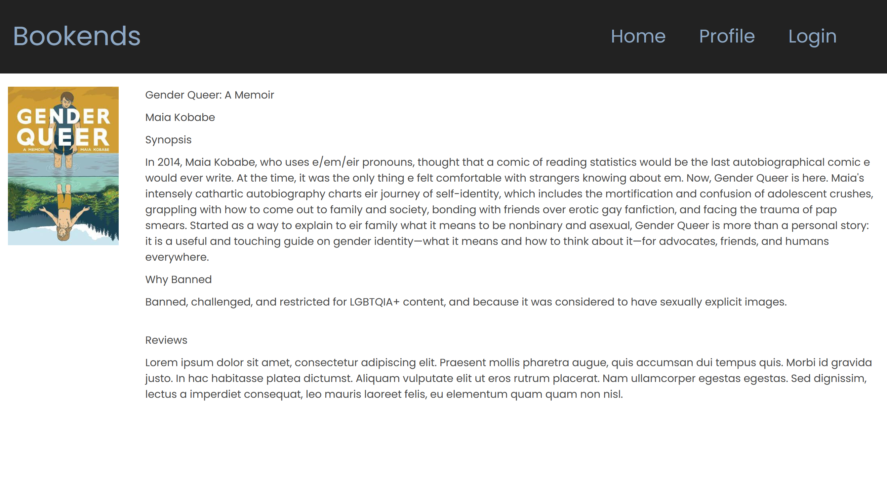

# Bookends

## Description
Bookends is an application for reviewing and sharing banned books with other Bookends users. Scroll through our library of recently banned books, review the ones you have read, or check out reviews from other user! Compile your own library of banned books through your very own profile page! 

Bookends was created with the intention of supporting and promoting banned books and their authors - each book 'profile' will have a description of why it has been challenged or banned - we hope to promote open-mindedness and remind others why suppressing literature is unacceptable.  

## Application Showcase

## Deployed Application
[Bookends via Heroku](https://autumn-bird-7789.herokuapp.com/)
### 

## Technologies Used

  * Node.js and Express.js
  * MySQL and Sequelize
  * Handlebars
  * Express-session (Cookies)
  * Connect-session-sequelize
  * Dotenv (Protecting info)
  * Bcrypt (Hashing passwords)
  * Boxicons (Fonts)
  * Bulma (Styling)
  * Git, GitHub, and Heroku
  * Nodemon

  
## Contributors

  * [Jonathan A.](https://github.com/aguilarj5)
  * [Christopher H.](https://github.com/eddercoppen)
  * [Katherine K.](https://github.com/kkarrwrites)
  * [Olivia S.](https://github.com/oscalenghe)
  * [Geraldo S.](https://github.com/garysk94)

## Resources

* [Top 10 Most Challenged Books Lists from the  ALA Office for Intellectual Freedom](https://www.ala.org/advocacy/bbooks/frequentlychallengedbooks/top10)
